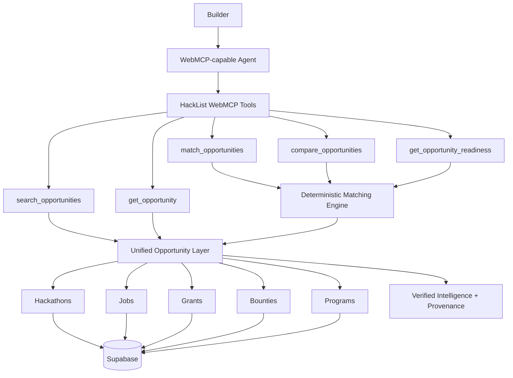

# HackList


**The opportunity intelligence layer for builders and their AI agents.**

HackList helps developers discover AI & Web3 hackathons, jobs, grants, bounties, and programs.

With WebMCP, HackList goes beyond discovery.

Instead of only asking:

> “What opportunities exist?”

builders can now ask:

> **“Which opportunities actually fit me, why, and what do I need to do next?”**

🌐 **Live:** https://hacklist.io  
💻 **Repository:** https://github.com/Benita2001/Hacklist

---

## Why HackList

Great opportunities are scattered across dozens of platforms.

Even after a builder finds one, the harder questions remain:

- Am I actually eligible?
- Does this match my skills?
- Can I realistically complete it before the deadline?
- Is the higher-prize opportunity actually the better choice?
- What exactly do I need to apply or submit?
- Which details are verified, and which are still unknown?

HackList already serves a community of **10,000+ developers and builders** looking for AI and Web3 opportunities.

For the WebMCP Challenge, HackList was extended from a human-facing opportunity directory into an **agent-native decision layer**.

---

# WebMCP

HackList exposes semantic opportunity tools directly to compatible browser agents through the canonical WebMCP API:

```ts
document.modelContext.registerTool({
  name: 'search_opportunities',
  description:
    'Search active HackList opportunities across hackathons, jobs, grants, bounties, and programs using real Supabase data.',
  inputSchema: {
    // structured agent inputs
  },
  execute: async (input) => {
    // calls the real HackList opportunity API
  },
});
```

The real registrations live in:

`src/components/webmcp/WebMcpRegistrar.tsx`

All current tools are **read-only**.

---

## WebMCP tools

| Tool | What it lets an agent do |
|---|---|
| `search_opportunities` | Search live HackList opportunities across hackathons, jobs, grants, bounties, and programs |
| `get_opportunity` | Retrieve structured details for a specific opportunity |
| `match_opportunities` | Find opportunities that fit a builder's supplied skills, location, interests, availability, and constraints |
| `compare_opportunities` | Compare opportunities using category-aware decision criteria |
| `get_opportunity_readiness` | Explain known requirements, constraints, and next steps for pursuing an opportunity |

The tools operate on **real HackList / Supabase data**, not mocked demo responses.

---

## What makes this different

Most websites force agents to infer meaning from:

- cards
- buttons
- filters
- text
- DOM structure

HackList exposes the meaning of the product directly.

The agent does not need to learn how the HackList interface works.

It can ask HackList to:

**search → understand → match → compare → prepare**

This creates a clean separation of responsibilities:

> **The agent understands the person. HackList understands the opportunities. WebMCP connects them.**

---

# Example

A builder can ask:

> “I'm a React developer in Ghana with a few days free. What hackathons on HackList fit me?”

The browser agent can translate that request into structured input such as:

```json
{
  "types": ["hackathon"],
  "country": "Ghana",
  "skills": ["React"],
  "availableDays": 3
}
```

HackList then performs the domain reasoning.

It can evaluate known information such as:

* geographic eligibility
* technology fit
* skills
* interests
* opportunity format
* deadline
* time availability
* requirements
* data completeness

The same architecture works for jobs, grants, bounties, programs, or mixed opportunity discovery.

---

# Explainable matching

HackList does not send a list of opportunities to an LLM and ask it to invent a ranking.

Matching is deterministic and application-owned.

The engine uses states such as:

```text
PASS
FAIL
UNKNOWN
```

and fit classifications such as:

```text
STRONG_FIT
POSSIBLE_FIT
WEAK_FIT
INSUFFICIENT_DATA
```

For example:

```text
AI Gateway Hackathon

Fit              STRONG_FIT
Eligibility      PASS
Technology fit   STRONG
Format            PASS
Time feasibility RISKY
Data confidence  HIGH
```

If a fact has not been verified, HackList returns `UNKNOWN`.

It does not fabricate certainty.

---

# Honest incomplete-data behavior

Not every opportunity has the same level of structured intelligence yet.

HackList deliberately preserves that uncertainty.

An unenriched opportunity can still be discovered through the live catalog, but deeper matching may return:

```text
Eligibility       UNKNOWN
Technology fit    UNKNOWN
Confidence        LOW
Overall           INSUFFICIENT_DATA
```

The opportunity does not silently disappear, and HackList does not invent missing facts.

---

# Opportunity coverage

The unified WebMCP layer works across HackList's five existing opportunity categories:

* 🏆 Hackathons
* 💼 Jobs
* 💰 Grants
* 🎯 Bounties
* 🚀 Programs

The existing Supabase listing workflow remains unchanged.

WebMCP sits above the existing application as a semantic agent interface.

---

# Critical demo flow

The core human-agent workflow is:

```text
Builder
   │
   │ "What opportunities fit me?"
   ▼
Browser Agent
   │
   ▼
match_opportunities
   │
   ▼
HackList deterministic engine
   │
   ▼
Live opportunity data
   │
   ▼
Explainable recommendation
```

Then:

```text
"Why this one instead of the other one?"
        ↓
compare_opportunities
```

Then:

```text
"What do I need to do next?"
        ↓
get_opportunity_readiness
```

One continuous decision workflow.

---

# Architecture



---

# Human + agent experience

WebMCP does not replace the HackList UI.

Humans can continue browsing HackList normally.

When an agent uses HackList's semantic tools, the site also exposes lightweight visible agent activity so the user can see that the website is participating in the interaction.

The goal is not:

> “AI replacing the website.”

The goal is:

> **human + agent + website working together.**

---

# WebMCP implementation

HackList uses the imperative WebMCP API through:

```ts
document.modelContext.registerTool(...)
```

Each tool includes:

* semantic `name`
* clear `description`
* structured `inputSchema`
* real `execute` behavior
* read-only annotations
* lifecycle cleanup
* graceful unsupported-browser behavior

Current tools use:

```ts
readOnlyHint: true
```

because the WebMCP layer searches and reasons over opportunities but does not mutate HackList data.

---

# Existing HackList vs Challenge work

HackList existed before the WebMCP Challenge.

### Before the challenge

HackList was primarily a human-facing AI & Web3 opportunity discovery product.

Builders could browse:

* hackathons
* jobs
* grants
* bounties
* programs

### Added during the WebMCP Challenge

The challenge-period extension introduced:

* canonical `document.modelContext.registerTool(...)` integration
* unified WebMCP opportunity tools
* opportunity normalization across all five categories
* deterministic matching
* geographic eligibility normalization
* explicit `PASS / FAIL / UNKNOWN` reasoning
* category-aware comparisons
* opportunity readiness analysis
* verified intelligence and provenance handling
* graceful incomplete-data behavior
* WebMCP-specific automated tests
* visible agent activity state
* production Chrome WebMCP validation
* repository and submission compliance work

The public Git history provides dated evidence of the challenge-period implementation.

---

# Tech stack

* **WebMCP**
* **Next.js 16**
* **React 19**
* **TypeScript**
* **Supabase**
* **PostgreSQL**
* **Tailwind CSS**
* **Fuse.js**
* **Vercel**
* **Chrome WebMCP tooling**

---

# Running locally

## 1. Clone

```bash
git clone https://github.com/Benita2001/Hacklist.git
cd Hacklist
```

## 2. Install dependencies

```bash
npm install
```

## 3. Configure environment

Create `.env.local` with the Supabase values used by HackList:

```env
NEXT_PUBLIC_SUPABASE_URL=your_supabase_url
NEXT_PUBLIC_SUPABASE_ANON_KEY=your_supabase_anon_key
```

Do not commit secrets.

## 4. Start development

```bash
npm run dev
```

Open:

```text
http://localhost:3000
```

---

# Testing WebMCP

## Chrome

Use Chrome 149+.

Enable:

```text
chrome://flags/#enable-webmcp-testing
```

Restart Chrome and open HackList.

The semantic tools can then be inspected through Chrome's WebMCP tooling.

## Example test prompts

Try:

> “Show me active AI opportunities on HackList.”

> “I'm a React and Python developer in Ghana with a few days free. Which hackathons here fit me?”

> “Tell me more about the first result.”

> “Compare the first two.”

> “What would I need to submit or do for the one you recommend?”

---

# Quality checks

```bash
npm run test:webmcp
npm run lint
npm run build
```

The WebMCP test suite covers matching behavior and opportunity reasoning.

---

# What we learned

The biggest lesson from building HackList for WebMCP was that making a website agent-native is not the same as automating its UI.

Buttons are not domain capabilities.

The useful semantic operations were higher-level goals:

```text
search
match
compare
understand
prepare
```

The second major lesson was that **uncertainty should be structured rather than hidden**.

An agent experience becomes more trustworthy when the website can clearly distinguish:

> “I know.”

> “This fails a verified constraint.”

> “I don't have enough verified information.”

---

# What's next

The next step is deeper structured intelligence coverage across the HackList catalog.

Over time, more opportunities can gain verified information such as:

* eligibility
* technologies
* skills
* team rules
* geographic constraints
* application requirements
* submission requirements
* official source provenance

HackList's ingestion pipeline can also be automated so new opportunities are continuously discovered, verified, deduplicated, and prepared for publishing.

That creates a larger loop:

```text
automated discovery
        ↓
verified HackList data
        ↓
structured opportunity intelligence
        ↓
WebMCP
        ↓
builders + their agents
```

The long-term goal is simple:

> **HackList should become the opportunity intelligence layer builders and their agents rely on to decide what to pursue next.**

---

# License

MIT

See [`LICENSE`](./LICENSE).

```

### Why this version is stronger

This README deliberately follows the Hackathon OS principle that important judging requirements should have a visible path from **product behavior → implementation → verification → demo proof**. :contentReference[oaicite:2]{index=2} It also protects the Critical Demo Path rather than drowning the judge in every feature. :contentReference[oaicite:3]{index=3}

It improves your current README dramatically because the current one still opens with generic `create-next-app` boilerplate and sends judges to generic Next.js documentation before explaining what HackList actually is. 

One thing I would **not** add yet is a claim such as “tested successfully with ChatGPT” until you actually perform that final manual test. Hackathon OS explicitly says unknown/untested claims should stay unknown rather than being presented as verified. :contentReference[oaicite:5]{index=5}

After your ChatGPT test passes, we can make one final README revision to add:

**Tested with: ChatGPT in-app browser + Chrome 152 WebMCP tooling**

and then freeze it.
```
